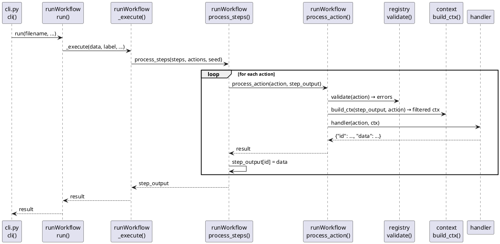

# 01 — Architecture

## Overview

`clay` is a Python CLI tool that executes JSON-defined workflows. Each workflow is a sequence of named steps; each step contains a list of action objects. Actions are dispatched by type string to dedicated Python handler functions. All persistent state between actions flows through a single dict called `step_output` (also referred to in comments as `previous_data`).

---

## Entry points

**`clay.py`** (repo root) — thin shim that calls `clay.cli.cli()`.

**`clay/cli.py`** — argument parsing and subcommand dispatch.

| Function | CLI command | Notes |
|---|---|---|
| `create(args)` | `clay create <name>` | Interactive workflow builder (writes JSON) |
| `run(args)` | `clay run <file>` | Loads file, calls `runWorkflow.run()` |
| `dryrun(args)` | `clay dryrun <file>` | Loads and pretty-prints the workflow JSON |
| `run_json(args)` | `clay run-json` | Reads full workflow JSON from stdin or `--file` |
| `lint(args)` | `clay lint [path]` | Validates workflow + data JSON files |
| `cli()` | _(default, no subcommand)_ | Launches `workflows/system/editor/main.json` |

Global flags accepted before or after the subcommand:

| Flag | Effect |
|---|---|
| `--daemon` | Fully unattended: AI answers all decisions, shell auto-approved |
| `--plainStdout` / `--ci` | Disable ANSI colours and animations |
| `--theme PATH` | Load a custom `.theme` file (overrides `CLAY_THEME` env var) |
| `--auto` | Replace `humanDecision` steps with AI-generated answers |

On every invocation `cli()` calls `_load_config()` (cli.py:119–126) which reads `configs/default.json` and the registry JSON Schema, seeds them into `__config__` and `__schema__` globals, and writes copies to `~/.clay/`. (cli.py:238–245)

---

## Execution core — `clay/run/runWorkflow.py`

```
run(filename, ...)
  └─ loadFile(filename)              # JSON parse, returns None on error
  └─ _execute(data, label, ...)      # shared core — never touches disk
       ├─ logger.start(label)     # open log file (root call only)
       ├─ termui.startup_banner(...)
       └─ process_steps(steps, actions, seed, ...)
            └─ process_action(action, step_output, ...)   # per action
                 ├─ _resolve_action_fields(...)            # {override:key} expansion
                 ├─ _validate(action)                      # schema registry check
                 ├─ build_ctx(step_output, action)         # includedData filter
                 └─ <handler>(action, ctx)                 # type dispatch
```

`run_from_data(data, label, initial_data, auto)` (runWorkflow.py:248–251) skips file loading and calls `_execute()` directly — used by `run-json`.

### `process_steps` — data accumulation (runWorkflow.py:171–187)

```python
def process_steps(steps, actions, initial_data=None, auto=False,
                  auto_context=None, model=None, daemon=False):
    step_output = dict(initial_data or {})
    for step in steps:
        step_actions = actions.get(step, [])
        for action in step_actions:
            result = process_action(action, step_output, ...)
            if result:
                if result.get("merge") and isinstance(result.get("data"), dict):
                    step_output.update(result["data"])
                elif result.get("id"):
                    step_output[result["id"]] = result["data"]
    return step_output
```

The initial seed merges `defaults` with `initial_data`: `seed = {**defaults, **(initial_data or {})}` so `initial_data` wins on collision. (runWorkflow.py:232)

Actions returning `{"merge": True, "data": {...}}` have all their data keys merged flat (used by `loadContext`). All other actions store under `result["id"]`.

### `process_action` dispatch (runWorkflow.py:63–168)

1. `_resolve_action_fields` replaces `{"override": "key"}` field values with the corresponding `step_output` entry (runWorkflow.py:45–60)
2. `_validate(action)` checks required fields; errors are printed and the action returns `None`
3. `build_ctx(step_output, action)` applies `includedData` filtering
4. Type dispatch via if/elif chain

`_SILENT_RESULT_TYPES = frozenset({'humanDecision', 'humanShell', 'loop', 'workflow'})` — these types do not have their result previewed in the log file. (runWorkflow.py:41)

`_PREVIEW_CHARS = 100000` — preview cap for log entries. (runWorkflow.py:42)

---

## Workflow JSON structure

```json
{
  "autoContext": "injected into every AI call in --auto mode",
  "defaults":    { "key": "value" },
  "model":       "optional model ID for all scramda2 calls in this file",
  "workflow":    { "steps": ["step1", "step2"] },
  "actionSets":  {
    "step1": [ { "type": "...", "id": "...", ... } ],
    "step2": [ ... ]
  }
}
```

`workflow.steps` is the execution order. Steps not found in `actionSets` are silently skipped.

---

## Module map

```
clay/
├── clay.py                       entry shim
├── configs/default.json             model profiles, userAgent strings
├── memory/                          per-namespace JSON entry files
├── skills/                          per-skillset skill files
├── webactions/                      site profile JSON files
├── workflows/                       workflow JSON files
└── clay/
    ├── cli.py                       CLI parsing + subcommand dispatch
    ├── lint.py                      workflow linter
    ├── lib/context.py               build_ctx(), RESERVED_KEYS, PASSTHROUGH_KEYS
    ├── run/
    │   ├── runWorkflow.py           engine core
    │   ├── logger.py                RunLogger + module-level helpers
    │   └── termui/
    │       ├── __init__.py          public API facade + auto-detect plain mode
    │       ├── engine.py            rendering functions
    │       ├── loader.py            theme file parser + cache
    │       ├── spinner.py           Spinner class
    │       └── themes/default.theme aurora colour/symbol definitions
    └── actions/
        ├── registry.py              schema dataclasses, validate(), export_json()
        ├── api_actions.py           API
        ├── file_actions.py          writeFile
        ├── human_decision.py        humanDecision
        ├── mongo_actions.py         mongo
        ├── python_actions.py        python
        ├── report_actions.py        report
        ├── scramda2_actions.py      scramda2
        ├── transform_data_actions.py  transformData
        ├── workflow_actions.py      workflow
        └── agent/
            ├── context_actions.py   loadContext
            ├── create_action.py     createAgentAction
            ├── human_shell_actions.py  humanShell
            ├── loop_actions.py      loop
            ├── memory_actions.py    writeMemory, searchMemory, listMemory, readMemory
            ├── runcode_actions.py   runCode
            ├── shell_actions.py     shell
            ├── skill_actions.py     writeSkill, listSkills, removeSkill, searchSkills
            ├── tag_actions.py       deriveTags + shared derive_tags()
            ├── web_actions.py       browseWeb, searchWeb, listSites, loadSite
            └── writecode_actions.py writeCode
```

---

## PlantUML — top-level call flow



---

## Cleanup / Old Paradigms

- The working dict is `step_output` in `process_steps` but is called `previous_data` in older inline comments and early docstrings. They are the same object.
- `workflow_actions.handler` accepts `model=None` and passes it to `runWorkflow.run()`, but the `process_action` dispatcher never passes `model` when calling `workflow_actions.handler` (runWorkflow.py:88) — the field is unused.
- `run_from_data` does not accept a `daemon` flag; the API path does not support daemon mode.
- `ACTION_TYPES` in `cli.py:8–18` powers only the interactive `create` wizard. It is a separate manual list and can diverge from the canonical registry in `registry.py`.
