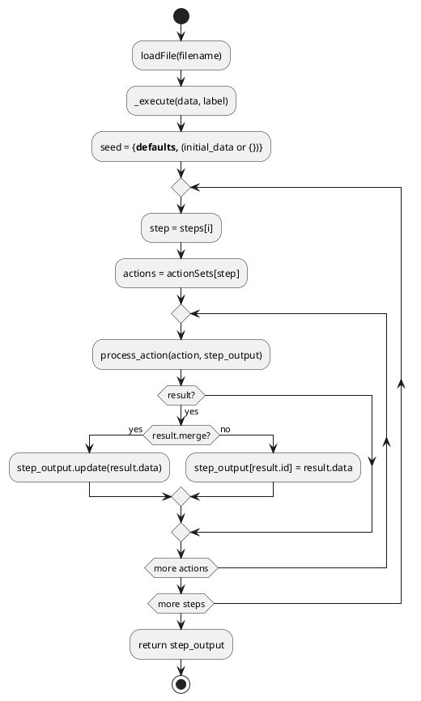

# 02 — Workflow Schema

## Purpose

A workflow file is the primary authoring artifact in clay. It is a plain JSON file that declares what the engine should do. The engine (`runWorkflow._execute`) reads the file and drives execution entirely from its structure.

---

## Top-level keys

| Key | Type | Required | Description |
|---|---|---|---|
| `workflow` | object | yes | Contains the `steps` array |
| `actionSets` | object | yes | Maps step names to arrays of action objects |
| `defaults` | object | no | Key/value pairs seeded into `step_output` before execution |
| `autoContext` | string | no | Text prepended to every AI call when `--auto` is active |
| `model` | string | no | Model ID applied to all `scramda2` actions in this file unless overridden per-action |

`workflow.steps` controls execution order. Only keys listed in `workflow.steps` are executed. Keys in `actionSets` that are not listed in `steps` are silently skipped (and reported as warnings by the linter).

---

## Minimal example

```json
{
  "workflow": { "steps": ["ask", "save"] },
  "actionSets": {
    "ask": [
      { "id": "name", "type": "humanDecision", "prompt": "What is your name?" }
    ],
    "save": [
      { "id": "path", "type": "writeFile", "file": "output/name.txt", "content": "name" }
    ]
  }
}
```

---

## `defaults`

Values in `defaults` are placed into `step_output` before any action runs. They are overridden by `initial_data` passed from the caller (e.g. a parent workflow). The merge is: `seed = {**defaults, **(initial_data or {})}` (runWorkflow.py:232).

```json
{
  "defaults": {
    "depth": "comprehensive",
    "output_dir": "output"
  },
  "workflow": { "steps": ["run"] },
  "actionSets": {
    "run": [
      { "id": "result", "type": "scramda2", "prompt": "Explain {depth} AI ethics" }
    ]
  }
}
```

---

## `autoContext`

When the engine is invoked with `--auto` (or `--daemon`), `autoContext` is prepended to every `humanDecision` AI prompt. See `human_decision.py:36–43`:

```python
if auto:
    parts = []
    if auto_context:
        parts.append(auto_context)
    if ctx:
        context_lines = "\n".join(f"  {k}: {str(v)[:200]}" for k, v in ctx.items())
        parts.append(f"Accumulated context:\n{context_lines}")
    parts.append(resolved_prompt)
    full_prompt = "\n\n".join(parts)
```

---

## Action object structure

Every action in an `actionSets` array is a JSON object. Common fields:

| Field | Type | Required | Description |
|---|---|---|---|
| `type` | string | yes | Action type identifier (e.g. `"scramda2"`, `"shell"`) |
| `id` | string | yes (for most types) | Key under which the action result is stored in `step_output` |
| `includedData` | array of strings | no | If present, limits which context keys are passed to the handler |

Additional fields are type-specific. See `docs/documentation/action-reference.json` for the full JSON Schema.

---

## `includedData` filtering

When `includedData` is present on an action, `build_ctx` (context.py:21–52) returns only the listed keys. When absent, the full `step_output` minus `RESERVED_KEYS` is passed.

Supported entry formats:

| Format | Result in ctx |
|---|---|
| `"key"` | `ctx["key"] = step_output["key"]` |
| `"a.b"` | `ctx["b"] = step_output["a"]["b"]` (leaf as key name) |
| `"alias=a.b.c"` | `ctx["alias"] = step_output["a"]["b"]["c"]` |

Engine-seeded globals (`__config__`, `__schema__`) are only delivered when explicitly listed in `includedData`. (context.py:6–8)

---

## `override` field resolution

Any field value of the form `{"override": "key"}` is replaced with `step_output[key]` before the action runs. This allows non-string fields (arrays, objects) to be sourced from previous action results. (runWorkflow.py:45–60)

```json
{
  "id": "result",
  "type": "API",
  "endpoint": "https://api.example.com/data",
  "headers": { "override": "my_headers_dict" }
}
```

---

## Sub-workflow invocation

The `workflow` action type runs another workflow file and stores its full `step_output` dict under the action's `id`. The `outputKey` field (default `"final"`) is logged but the stored value is always the complete dict. (workflow_actions.py, test_core.py:228–256)

The `loop` action runs a sub-workflow repeatedly. See `04-context-and-scope.md` for context propagation details.

---

## Developer workflow example — `workflows/developer/main.json`

```json
{
  "autoContext": "You are an autonomous software development agent...",
  "workflow": {
    "steps": ["load_goal","plan","research_loop","review_plan","dev_loop","test_loop","report"]
  },
  "actionSets": {
    "load_goal": [
      { "id": "goal",         "type": "loadContext", "file": "workflows/developer/goal.json" },
      { "id": "timestamp",    "type": "shell",       "command": "date +%s" },
      { "id": "memory_index", "type": "listMemory",  "namespace": "developer" },
      { "id": "skills_index", "type": "listSkills",  "skillset": "developer" }
    ],
    "plan": [
      { "id": "dev_plan", "type": "scramda2", "prompt": "...",
        "includedData": ["goal","tech_preferences","constraints","prior_context","skills_index"] }
    ]
  }
}
```

---

## PlantUML — workflow execution sequence



---

## Cleanup / Old Paradigms

- Early workflow files used a `"template"` field on `report` actions. The `report_actions.handler` does not read that field; it reads `body`, `to_email`, etc. directly.
- `model` at the workflow root is read by `_execute` (runWorkflow.py:231) but the per-action `model` and `modelProfile` fields on `scramda2` take precedence in `scramda2_actions.handler`.
- The `outputKey` field on `workflow` actions is present in the schema but the stored result is always the full sub-workflow `step_output` dict, not the extracted value. `outputKey` default is `"final"` (registry.py:80) but the extraction only happens if the caller explicitly uses dot-notation in `includedData`.
