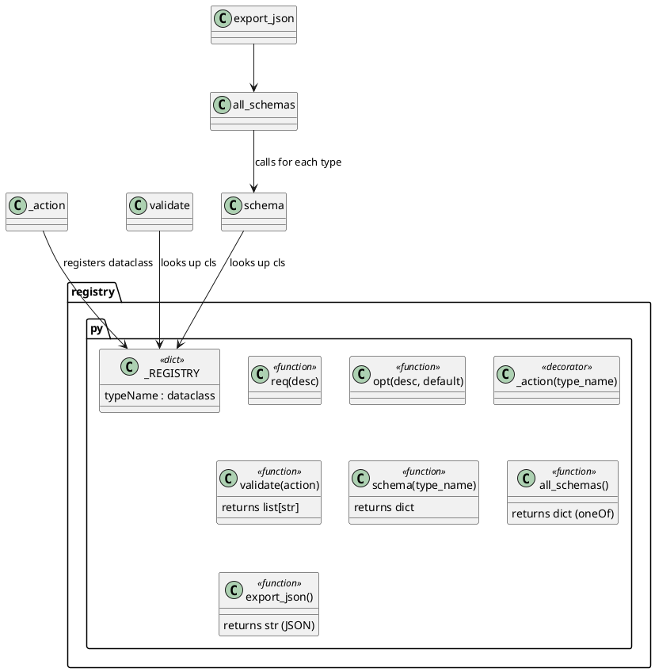

# 03 — Action Registry

## Purpose

`clay/actions/registry.py` is the single source of truth for all action type schemas. It serves three roles:

1. **Validation** — `validate(action)` is called for every action before it runs (runWorkflow.py:69)
2. **JSON Schema export** — `export_json()` produces a combined JSON Schema (oneOf) written to `~/.clay/schema.json` on startup
3. **Documentation** — the schema dataclasses are the authoritative field reference used by `docs/documentation/action-reference.json`

---

## Public API

```python
from clay.actions.registry import validate, schema, export_json

errors = validate(action_dict)   # → list[str]  (empty = valid)
s      = schema('shell')         # → JSON Schema dict for one type
dump   = export_json()           # → combined JSON string (all types)
```

Running as a script:

```
python -m clay.actions.registry            # print all types
python -m clay.actions.registry shell      # print one type
```

---

## Internal design

### Field descriptors (registry.py:24–30)

```python
def req(desc: str) -> Any:
    """Required field — must be present in the action JSON."""
    return field(metadata={"desc": desc})

def opt(desc: str, default: Any = None) -> Any:
    """Optional field with a default value (None if not specified)."""
    return field(default=default, metadata={"desc": desc})
```

### `_action` decorator (registry.py:37–42)

```python
_REGISTRY: dict[str, type] = {}

def _action(type_name: str):
    """Register a plain class as a dataclass action schema."""
    def decorator(cls):
        _REGISTRY[type_name] = dataclass(cls)
        return _REGISTRY[type_name]
    return decorator
```

Classes decorated with `@_action('typeName')` are converted to dataclasses and stored in `_REGISTRY`. The decorator returns the dataclass, so the name in `_REGISTRY` and the module-level name both refer to the dataclass.

### `validate` (registry.py:256–275)

```python
def validate(action: dict) -> list[str]:
    action_type = action.get('type')
    if not action_type:
        return ["missing 'type' field"]
    cls = _REGISTRY.get(action_type)
    if cls is None:
        return []  # unknown type — let the dispatcher report it
    return [
        f"'{action_type}' missing required field '{f.name}'"
        for f in dc_fields(cls)
        if f.default is MISSING and f.default_factory is MISSING
        and f.name not in action
    ]
```

Key behaviour: **unknown action types return an empty list** (no validation error). The dispatcher in `runWorkflow.process_action` is responsible for reporting unknown types.

### `schema` (registry.py:295–319)

Builds a JSON Schema `object` with a `const` constraint on `type`. Required fields are listed in `required`. Optional fields include a `default` key when the default is not `None`.

### `all_schemas` / `export_json` (registry.py:321–331)

```python
def all_schemas() -> dict:
    return {
        "$schema": "https://json-schema.org/draft/2020-12",
        "title": "ClayAction",
        "oneOf": [schema(name) for name in _REGISTRY],
    }

def export_json(indent: int = 2) -> str:
    return json.dumps(all_schemas(), indent=indent)
```

---

## Registered action types (in registry order)

The `_REGISTRY` dict preserves insertion order (Python 3.7+). Types are registered in this order:

1. `humanDecision` — `HumanDecision`
2. `humanShell` — `HumanShell`
3. `shell` — `Shell`
4. `scramda2` — `Scramda2`
5. `workflow` — `Workflow`
6. `loop` — `Loop`
7. `API` — `API`
8. `mongo` — `Mongo`
9. `report` — `Report`
10. `python` — `Python`
11. `transformData` — `TransformData`
12. `writeFile` — `WriteFile`
13. `writeCode` — `WriteCode`
14. `runCode` — `RunCode`
15. `loadContext` — `LoadContext`
16. `deriveTags` — `DeriveTags`
17. `writeMemory` — `WriteMemory`
18. `searchMemory` — `SearchMemory`
19. `listMemory` — `ListMemory`
20. `readMemory` — `ReadMemory`
21. `writeSkill` — `WriteSkill`
22. `listSkills` — `ListSkills`
23. `removeSkill` — `RemoveSkill`
24. `searchSkills` — `SearchSkills`
25. `browseWeb` — `BrowseWeb`
26. `searchWeb` — `SearchWeb`
27. `listSites` — `ListSites`
28. `loadSite` — `LoadSite`
29. `createAgentAction` — `CreateAgentAction`

Total: 29 types in the registry.

---

## Type-level Python → JSON type mapping (registry.py:280–287)

```python
_PY_TO_JSON: dict[type, str] = {
    str:   "string",
    int:   "integer",
    float: "number",
    bool:  "boolean",
    list:  "array",
    dict:  "object",
}
```

`Optional[X]` annotations are unwrapped to `X` before the lookup (registry.py:290–293).

---

## Convention: required fields first

From the module docstring (registry.py:46):

> Convention: req() fields first, opt() fields after (Python dataclass rule).
> Field order determines the docs table order.

---

## PlantUML — registry internals



---

## Cleanup / Old Paradigms

- The linter (`lint.py:39`) imports `_REGISTRY` directly from the registry (`from .actions.registry import validate as _validate_action, _REGISTRY`) to check whether an action type is known. This creates a tight coupling between the linter and the registry internals.
- `additionalProperties: true` is set on every schema object (registry.py:318), so unknown fields on actions never cause validation errors. This is intentional — it allows workflow authors to add notes or future fields without breaking validation.
- The `LoadContext` schema marks `id` as required with the description "Required but ignored — all keys from the file merge into context directly" (registry.py:152–153). The field is needed by the dispatcher's `result.get("id")` path, even though the value is discarded by `process_steps` when `merge=True`.
