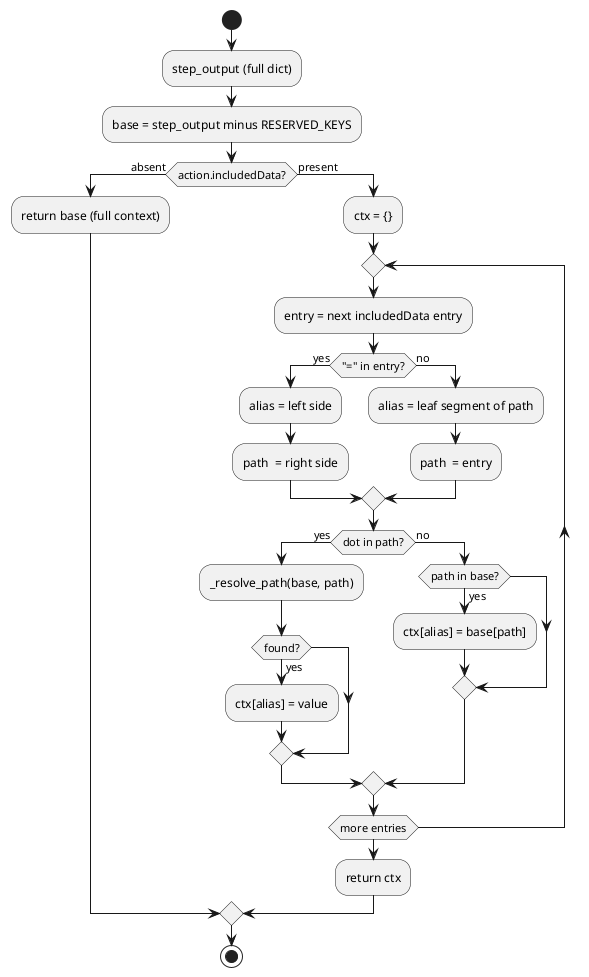

# 04 — Context and Scope

## Purpose

`clay/lib/context.py` defines the rules by which context data flows from the engine's shared state into individual action handlers. Understanding scope is essential for writing correct workflows — it determines what data each action can see.

---

## Module constants (context.py:3–7)

```python
RESERVED_KEYS = frozenset()          # nothing blocked by default anymore

# Engine-seeded globals. Actions must list these in includedData to receive
# them — the engine does NOT auto-inject. The frozenset documents what exists.
PASSTHROUGH_KEYS = frozenset({'__config__', '__schema__'})
```

`RESERVED_KEYS` is currently empty, so all keys pass through the base filter. `PASSTHROUGH_KEYS` documents the globals that the engine seeds into `step_output` but that are only delivered to handlers when explicitly listed in `includedData`.

---

## `build_ctx` (context.py:21–52)

```python
def build_ctx(step_output: dict, action: dict) -> dict:
```

Called by `process_action` for every action. Returns the dict passed to the handler.

### Without `includedData`

```python
base = {k: v for k, v in step_output.items() if k not in RESERVED_KEYS}
included = action.get('includedData')
if included is None:
    return base
```

The full `step_output` minus `RESERVED_KEYS` (currently empty set) is returned. `__config__` and `__schema__` are present in `step_output` but since `RESERVED_KEYS` is empty they do pass through in this mode.

### With `includedData`

When `includedData` is a list, only the listed keys are included. Three entry formats are supported:

| Format | ctx key | Source path |
|---|---|---|
| `"key"` | `"key"` | `step_output["key"]` |
| `"a.b"` | `"b"` | `step_output["a"]["b"]` (leaf segment as name) |
| `"alias=a.b.c"` | `"alias"` | `step_output["a"]["b"]["c"]` |

```python
ctx = {}
for entry in included:
    if '=' in entry:
        alias, path = entry.split('=', 1)
    else:
        alias = entry.rsplit('.', 1)[-1]   # leaf segment as ctx key
        path = entry
    if '.' in path:
        val, found = _resolve_path(base, path)
        if found:
            ctx[alias] = val
    elif path in base:
        ctx[alias] = base[path]
return ctx
```

Missing keys are silently dropped (no error). `__config__` and `__schema__` are only available when explicitly listed.

### `_resolve_path` (context.py:10–18)

```python
def _resolve_path(base: dict, path: str):
    """Walk a dot-separated path into nested dicts. Returns (value, found)."""
    val = base
    for part in path.split('.'):
        if isinstance(val, dict) and part in val:
            val = val[part]
        else:
            return None, False
    return val, True
```

---

## Loop context propagation (loop_actions.py:41–89)

The `loop` action manages its own context handoff between iterations:

```python
# Holds the original calling context — never modified between iterations.
parent_seed = dict(ctx)

# Carries the previous iteration's full step_output forward so action
# outputs are available in the next iteration.
prev_result_data = {}

# Each iteration seed:
iteration_seed = {
    **parent_seed,
    **prev_result_data,   # previous iteration's outputs overwrite stale parent values
    'iteration': str(i),  # always reflects the current iteration number
}
```

`loop_history` (the `outputKey` values from each iteration) is written to the log only — it is NOT injected into the iteration seed, keeping the context window bounded. (loop_actions.py:76–79)

---

## Sub-workflow context propagation (workflow_actions.py)

The `workflow` action calls `runWorkflow.run(filename, initial_data=ctx, ...)`. The sub-workflow's `step_output` is initialised with `initial_data=ctx` from the parent, so all keys visible to the `workflow` action (after `build_ctx` filtering) are available as `step_output` defaults in the sub-workflow.

The sub-workflow's full `step_output` is returned as the action result:
```python
result_data = runWorkflow.run(filename, initial_data=ctx, auto=auto, model=model)
action_id = action.get('id')
return {"id": action_id, "data": result_data} if action_id else None
```

The entire sub-workflow context is stored under the action `id` in the parent's `step_output`. Downstream actions use dot-notation (`"alias=sub_id.key"`) to extract specific values.

---

## `loadContext` — flat merge (context_actions.py)

The `loadContext` action reads a JSON file and returns `{"merge": True, "data": {...}}`. The `merge=True` flag causes `process_steps` to call `step_output.update(result["data"])` instead of storing under `result["id"]`. This flattens all top-level keys from the JSON file directly into `step_output`.

```python
# merge=True tells process_steps to unpack all keys into previous_data
return {"id": action.get("id"), "data": data, "merge": True}
```

The linter tracks which keys `loadContext` adds to scope. (lint.py:218–228)

---

## Scope at validation time (linter perspective)

The linter (`lint.py`) checks `includedData` scope. The available scope at any action is:

```
scope = defaults
      ∪ {__config__, __schema__}          # _SYSTEM_KEYS
      ∪ {iteration}                       # _LOOP_INJECTED_KEYS
      ∪ external_keys                     # keys from parent's includedData
      ∪ {ids of all preceding actions}
      ∪ {keys from preceding loadContext files}
```

Loop iteration files additionally receive all their own action IDs from the previous iteration's `step_output` (via `prev_result_data`). (lint.py:350–353)

---

## PlantUML — build_ctx flow



---

## Cleanup / Old Paradigms

- `RESERVED_KEYS` is defined as `frozenset()` — it was previously used to block certain keys from being passed to handlers. It is now empty, meaning all keys (including `__config__` and `__schema__`) are technically reachable without `includedData`, contrary to the `PASSTHROUGH_KEYS` documentation comment. The design intent is that `__config__`/`__schema__` require explicit listing, but the code does not enforce this without `includedData`.
- Old action handlers that do not specify `includedData` receive the full context including all previously accumulated action outputs. This is backward-compatible but means those handlers can inadvertently read keys they do not declare a dependency on.
