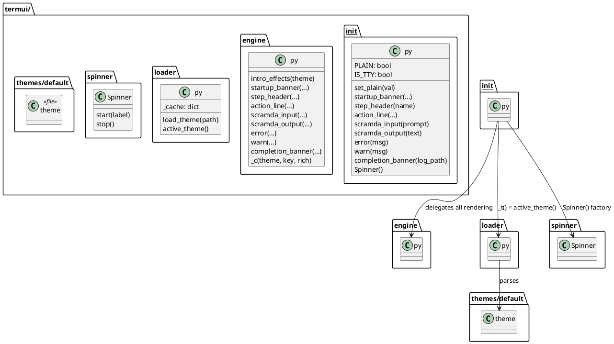

# 05 — Terminal UI (termui)

## Purpose

`clay/run/termui/` is the aurora-themed terminal output package. It produces all visual output: startup/completion banners, step dividers, action lines, scramda2 prompt/response boxes, error/warning messages, and the thinking spinner. It supports two output modes — rich (ANSI colours + animations) and plain (CI-safe text) — determined automatically at import time.

---

## Package structure

| File | Role |
|---|---|
| `__init__.py` | Public API facade; auto-detects plain mode; fires intro animation on import |
| `engine.py` | All rendering functions (pure: take theme dict + rich bool, write to stdout) |
| `loader.py` | Theme file parser and cache |
| `spinner.py` | `Spinner` class — non-blocking animated spinner |
| `themes/default.theme` | Default aurora colour/symbol definitions |

---

## Auto-detection at import (`__init__.py:17–27`)

```python
PLAIN: bool = '--ci' in sys.argv or '--plainStdout' in sys.argv
IS_TTY: bool = sys.stdout.isatty()

if IS_TTY and not PLAIN:
    threading.Thread(
        target=engine.intro_effects,
        args=(loader.active_theme(),),
        daemon=True,
    ).start()
```

`termui` is imported once (via `runWorkflow.py:5`), so the intro sweep fires immediately when the process starts in a rich terminal. `set_plain(val)` can override `PLAIN` after import.

---

## Public API (`__init__.py`)

All functions are thin wrappers that call into `engine.py` with `_t()` (active theme dict) and `_rich()` (bool).

| Function | Signature | Description |
|---|---|---|
| `set_plain(val)` | `(bool) → None` | Override PLAIN flag after import |
| `startup_banner(label, auto, log_path)` | `(str, bool, str) → None` | Print the startup box |
| `step_header(name)` | `(str) → None` | Print a step divider line |
| `action_line(action_type, action_id, detail)` | `(str, str, str) → None` | Print the action bullet |
| `scramda_input(prompt_text)` | `(str) → None` | Show the prompt being sent to AI (rich only) |
| `scramda_output(text)` | `(str) → None` | Show the AI response |
| `error(msg)` | `(str) → None` | Print an error message |
| `warn(msg)` | `(str) → None` | Print a warning message |
| `completion_banner(log_path)` | `(str) → None` | Print the completion box |
| `Spinner()` | `() → Spinner` | Return a ready-to-use `Spinner` instance |

`Spinner()` is a factory function (not a class) in `__init__.py`. It returns `_Spinner(_t(), _rich())` where `_Spinner` is `spinner.Spinner`. (`__init__.py:77–79`)

---

## `engine.py` rendering functions

All functions accept `theme: dict, rich: bool` as their last two parameters. The `_c(theme, key, rich)` helper returns an ANSI escape string or empty string:

```python
def _c(theme: dict, key: str, rich: bool) -> str:
    """Return ANSI escape for theme colour key, or empty string in plain mode."""
    if not rich:
        return ''
    code = theme.get(key, '')
    return f'\033[{code}m' if code else ''

RST = '\033[0m'
```

### `intro_effects(theme)` (engine.py:7–33)

Non-blocking aurora intro sweep, called in a daemon thread. Hides cursor, sweeps one shimmer line through the aurora colours, then erases the line. Total duration ≤ 0.3 s.

### `startup_banner(label, auto, log_path, theme, rich)` (engine.py:50–128)

In rich mode: prints a 6-line double-bordered box with shimmer animation using `SHIMMER_FRAMES` colour codes. In plain mode: plain `═` dividers.

Shimmer uses `FEATURE_SHIMMER` and `SHIMMER_ENABLED` flags. Cursor hide/show uses `FEATURE_CURSOR_HIDE`. The shimmer thread is joined (waited for) before workflow output begins. (engine.py:123)

### `step_header(name, theme, rich)` (engine.py:131–145)

Rich: `── name ─────── ◈ ──`-style line using `COLOR_BORDER`, `COLOR_STEP`, `COLOR_WARN`, `SYM_STEP_TRAIL`, `SYM_AURORA`.

Plain: `\n── name ─────────────────────────────────`

### `action_line(action_type, action_id, detail, theme, rich)` (engine.py:148–158)

Prints `  ▸ type_name  → id  detail` with `SYM_ACTION` and colour from `COLOR_ACTION`.

### `scramda_input(prompt_text, theme, rich)` (engine.py:161–176)

Only prints in rich mode and when `FEATURE_SCRAMDA_INPUT_BOX == 'true'`. Prints the **whole** prompt, line breaks intact — a truncated prompt hides exactly the part you need when a model misreads its instructions. Set `PROMPT_BOX_MAX_CHARS` to a positive number to cap it again; `0` (the default) means no limit. Uses `COLOR_PROMPT_BOX`.

The action line above the box omits its own `prompt="…"` field for `scramda2`, since the full prompt follows immediately.

### `scramda_output(text, theme, rich)` (engine.py:179–198)

Uses `SYM_RESPONSE_TOP`, `SYM_RESPONSE_BOTTOM`, `COLOR_RESPONSE`. In plain mode: plain `print(text)`.

### `error(msg, theme, rich)` / `warn(msg, theme, rich)` (engine.py:201–218)

Error uses `SYM_ERROR = '✕'`, `COLOR_ERROR`. Warn uses `SYM_WARN = '⚡'`, `COLOR_WARN`.

Plain mode: `  !! {msg}` / `  warning: {msg}`.

### `completion_banner(log_path, theme, rich)` (engine.py:221–246)

Prints a double-bordered box with `SYM_DONE = '✓'` and `COLOR_DONE`. Same layout as startup banner but always static (no shimmer).

---

## `spinner.Spinner` class (spinner.py)

```python
class Spinner:
    def __init__(self, theme: dict, rich: bool): ...
    def start(self, label: str = ''): ...
    def stop(self): ...
```

`start(label)` spawns a daemon thread that cycles through `SPINNER_FRAMES` (default: `◌ ◎ ● ◎ ◌ ·`) with `SPINNER_COLORS` at `SPINNER_INTERVAL_MS` milliseconds per frame. In plain mode it is a no-op. `stop()` sets the stop event, joins the thread (timeout 0.3 s), and erases the line with `\033[2K\r`.

Used in `runWorkflow.process_action` for `scramda2` calls:

```python
sp = termui.Spinner()
sp.start('thinking')
try:
    result = scramda2_actions.handler(action, ctx)
finally:
    sp.stop()
```

---

## `loader.py` — theme loading (loader.py)

```python
_PAIR_RE = re.compile(r'^([A-Z_]+)\s*=\s*"?(.*?)"?\s*$')
_cache = {}

def load_theme(path: str) -> dict:
    """Parse a .theme file into a plain dict. Results are cached by path."""

def active_theme() -> dict:
    """Return the currently active theme dict (env override or built-in default)."""
    path = os.getenv('CLAY_THEME') or _default_path()
    return load_theme(path)
```

Theme files are `bash KEY="VALUE"` format. Lines starting with `#` are ignored. Results are cached by path.

---

## `themes/default.theme` — aurora palette

| Category | Keys |
|---|---|
| Colours | `COLOR_BORDER=96` (bright cyan), `COLOR_ACTION=92` (bright green), `COLOR_STEP=97` (white), `COLOR_RESPONSE=97`, `COLOR_PROMPT_BOX=2;36`, `COLOR_ERROR=95` (magenta), `COLOR_WARN=94` (blue), `COLOR_DIM=2`, `COLOR_BOLD=1`, `COLOR_DONE=92` |
| Symbols | `SYM_ACTION=▸`, `SYM_AURORA=◈`, `SYM_ERROR=✕`, `SYM_WARN=⚡`, `SYM_DONE=✓`, `SYM_STEP_TRAIL=─`, `SYM_BANNER_H=═`, `SYM_RESPONSE_TOP=┄`, `SYM_RESPONSE_BOTTOM=╌`, `SYM_CORNER_TL=╔`, `SYM_CORNER_TR=╗`, `SYM_CORNER_BL=╚`, `SYM_CORNER_BR=╝` |
| Spinner | `SPINNER_FRAMES=◌ ◎ ● ◎ ◌ ·`, `SPINNER_COLORS=96 92 95 94 97 96`, `SPINNER_INTERVAL_MS=100`, `SPINNER_LABEL=thinking` |
| Shimmer | `SHIMMER_ENABLED=true`, `SHIMMER_FRAMES=96 92 95 94 97 96`, `SHIMMER_FRAME_MS=80` |
| Layout | `BANNER_WIDTH=52`, `STEP_RULE_WIDTH=46`, `PROMPT_BOX_MAX_CHARS=0` (0 = uncapped), `RESPONSE_INDENT=  ` (two spaces) |
| Feature flags | `FEATURE_BANNER=true`, `FEATURE_SPINNER=true`, `FEATURE_SCRAMDA_INPUT_BOX=true`, `FEATURE_SCRAMDA_OUTPUT_BOX=true`, `FEATURE_SHIMMER=true`, `FEATURE_CURSOR_HIDE=true`, `FEATURE_STEP_COLORS=true`, `FEATURE_ACTION_COLORS=true` |

---

## Custom themes

Set `CLAY_THEME=/path/to/my.theme` (env var) or pass `--theme /path/to/my.theme` on the CLI. `loader.active_theme()` checks `CLAY_THEME` first, then falls back to the built-in default.

The CLI sets the env var before anything else: `os.environ['CLAY_THEME'] = args.theme` (cli.py:133).

---

## PlantUML — termui module relationships



---

## Cleanup / Old Paradigms

- `FEATURE_BANNER`, `FEATURE_STEP_COLORS`, `FEATURE_ACTION_COLORS` are defined in the theme but not read in `engine.py`. Only `FEATURE_SCRAMDA_INPUT_BOX`, `FEATURE_SCRAMDA_OUTPUT_BOX`, `FEATURE_SHIMMER`, `FEATURE_CURSOR_HIDE`, and `SHIMMER_ENABLED` are actually checked in code.
- `startup_banner` in plain mode uses a hardcoded `'═' * 56` divider (engine.py:54–55) rather than reading `BANNER_WIDTH` from the theme. This differs from rich mode which uses `int(theme.get('BANNER_WIDTH', '52'))`.
