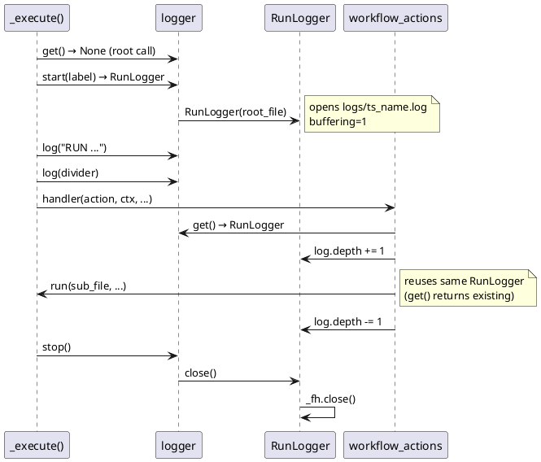

# 06 — Logger

## Purpose

`clay/run/logger.py` provides structured run logging. Every root-level workflow execution writes timestamped events to a file in `logs/`. Selected events are echoed to stdout. The module uses a module-level singleton: one `RunLogger` is active per process at any time.

---

## `RunLogger` class (logger.py:8–28)

```python
class RunLogger:
    def __init__(self, root_file):
        self.start = time.time()
        self.depth = 0
        os.makedirs('logs', exist_ok=True)
        ts = datetime.now().strftime('%Y-%m-%d_%H-%M-%S')
        name = os.path.splitext(os.path.basename(root_file))[0]
        self.path = f'logs/{ts}_{name}.log'
        self._fh = open(self.path, 'w', buffering=1)

    def _elapsed(self):
        return f'+{time.time() - self.start:.3f}s'

    def _pad(self):
        return '  ' * self.depth

    def log(self, line):
        self._fh.write(f'[{self._elapsed()}] {self._pad()}{line}\n')

    def close(self):
        self._fh.close()
```

| Attribute | Type | Description |
|---|---|---|
| `start` | float | `time.time()` at construction; used for elapsed timestamps |
| `depth` | int | Indentation level; incremented/decremented by `workflow_actions` for sub-workflows |
| `path` | str | Log file path, e.g. `logs/2026-03-18_14-05-30_main.log` |

`buffering=1` (line-buffered) ensures each `log()` call is flushed immediately.

`depth` is managed externally by `workflow_actions.handler`:
```python
if log:
    log.log(f'WORKFLOW →  {filename}')
    log.depth += 1
# ... run sub-workflow ...
if log:
    log.depth -= 1
    log.log(f'WORKFLOW ←  {os.path.basename(filename)}')
```

---

## Module-level functions (logger.py:31–77)

### Lifecycle

```python
_active = None   # module-level singleton

def start(root_file) -> RunLogger:
    """Create a new RunLogger and store it as the active singleton."""
    global _active
    _active = RunLogger(root_file)
    return _active

def get() -> RunLogger | None:
    """Return the active RunLogger, or None if not started."""
    return _active

def stop():
    """Close and clear the active RunLogger."""
    global _active
    if _active:
        _active.close()
        _active = None
```

`start()` is called by `_execute()` only when `is_root` — i.e. when `get()` returns None (no logger active). Sub-workflows called via `workflow_actions` reuse the existing singleton. (runWorkflow.py:216–219)

### Emit helpers (logger.py:48–77)

```python
def _emit(level: str, msg: str, show: bool):
    if _active:
        _active.log(f'{level}  {msg}')
    if show:
        print(f'  {msg}')

def trace(msg: str):  """Detailed internal trace — log file only."""
def debug(msg: str):  """Debug detail — log file only."""
def info(msg: str):   """Informational event — log file + stdout."""
def warn(msg: str):   """Warning — log file + stdout."""
def error(msg: str):  """Error — log file + stdout."""
```

| Level | Log file | stdout |
|---|---|---|
| `trace` | yes | no |
| `debug` | yes | no |
| `info` | yes | yes |
| `warn` | yes | yes |
| `error` | yes | yes |

Note: `logger.error(msg)` is distinct from `termui.error(msg)`. The logger writes a plain text line; termui adds ANSI colour and a `✕` symbol. The engine calls both where appropriate.

---

## Log format

Each line written by `RunLogger.log()`:

```
[+0.001s]   STEP  load_goal
[+0.002s]   ACTION  scramda2  "dev_plan"  ...
[+0.015s]     WORKFLOW →  workflows/developer/research-iteration.json
[+0.016s]       LOOP  iter=1/5  research-iteration.json
```

- `[+elapsed]` — seconds since `RunLogger.start`
- Indentation of two spaces per `depth` level
- Free-form structured text (not JSON)

The root `_execute` also writes dividers and a `RUN COMPLETE` footer. (runWorkflow.py:221–224, 238–241)

---

## Log file naming

```
logs/<YYYY-MM-DD>_<HH-MM-SS>_<workflow_stem>.log
```

`workflow_stem` = `os.path.splitext(os.path.basename(root_file))[0]`

Example: `logs/2026-03-18_14-05-30_main.log`

The `logs/` directory is created automatically (`os.makedirs('logs', exist_ok=True)`), relative to the current working directory.

---

## PlantUML — logger lifecycle



---

## Cleanup / Old Paradigms

- `logger.error()` and `termui.error()` are separate calls serving different roles. In `runWorkflow.process_action`, schema validation failures call `termui.error(e)` (for coloured terminal output) and also `log.log('!! SCHEMA ...')` (runWorkflow.py:72–74). The two systems are not unified.
- There is no log rotation or size limit. Long-running daemon workflows can accumulate large log files.
- `trace()` is defined but not called anywhere in the current codebase. `debug()` is used by several action handlers.
