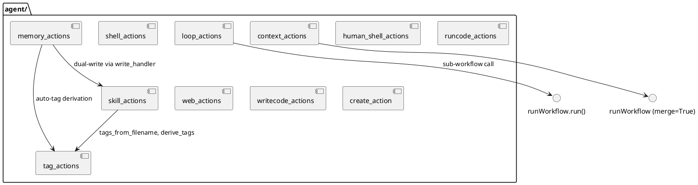

# 07 — Agent Actions

## Purpose

`clay/actions/agent/` contains the "agent tier" of action handlers — capabilities that enable AI-driven agentic workflows. These actions allow a workflow to execute shell commands, run code, loop iteratively, remember information across runs, browse the web, and extend itself by writing new action handlers.

---

## `shell_actions.py` — `shell`

Runs a whitelisted shell command and returns stdout.

### `ALLOWED_COMMANDS` (shell_actions.py:12–23)

```python
ALLOWED_COMMANDS = frozenset({
    'ifconfig', 'netstat', 'arp', 'ping', 'ping6', 'traceroute', 'traceroute6',
    'dig', 'nslookup', 'host', 'nmap', 'nc', 'curl', 'wget', 'lsof', 'ss',
    'networksetup', 'system_profiler',
    'hostname', 'uname', 'uptime', 'whoami', 'id', 'ps', 'df', 'du',
    'ls', 'cat', 'head', 'tail', 'echo', 'date', 'env', 'printenv',
    'avahi-browse',
})
```

Hardcoded. Not overridable via JSON or environment variables.

### Injection prevention (shell_actions.py:27)

```python
_INJECTION_RE = re.compile(r'[;&|`$<>()\\\n\r\t]')
```

Applied inside `_SafeMap.__getitem__`: all `{placeholder}` values from `ctx` have these characters stripped before substitution. The command template itself (from the action JSON) is not filtered.

### Whitelist check (shell_actions.py:71–78)

`_executables_in(command)` splits on `&&`, `||`, `;`, `|` and extracts the first token of each segment. All executables must be in `ALLOWED_COMMANDS`. Blocked commands return `None`.

### Execution (shell_actions.py:83–101)

```python
result = subprocess.run(
    command,
    shell=True,
    capture_output=True,
    text=True,
    timeout=timeout,
)
```

Non-zero exit code appends `[exit code: N]` to stdout. Timeout returns `[timeout after Ns]`.

---

## `human_shell_actions.py` — `humanShell`

Like `shell` but with a broader `DEVELOPER_COMMANDS` whitelist and a mandatory human approval gate. Even in `--auto` mode the human must approve; only `--daemon` skips the gate.

### `DEVELOPER_COMMANDS` (human_shell_actions.py:12–32)

```python
DEVELOPER_COMMANDS = frozenset({
    'npm', 'npx', 'pip', 'pip3', 'pipenv', 'poetry', 'yarn', 'pnpm',
    'node', 'python', 'python3',
    'git',
    'make', 'jest', 'pytest', 'vitest', 'mocha', 'cargo',
    'ls', 'cat', 'head', 'tail', 'echo', 'touch', 'mkdir', 'cp', 'mv',
    'find', 'grep', 'chmod', 'pwd', 'which', 'cd',
    'curl', 'wget',
    'docker', 'docker-compose',
    'env', 'printenv',
    'whoami', 'uname', 'date',
})
```

### Injection prevention (human_shell_actions.py:36)

```python
_INJECTION_RE = re.compile(r'[`\n\r\t]|\$\(')
```

Narrower than `shell_actions`: allows `;` and `&&` in values so compound dev commands work, but blocks backticks and `$()`.

### `skipValue` (human_shell_actions.py:66–75)

```python
if skip_value and command == skip_value.strip():
    logger.debug(f"humanShell: skipped ({skip_value})")
    return {"id": action.get("id"), "data": "[skipped]"}
```

If the resolved command equals `skipValue`, the action is skipped without prompting. This lets the AI signal "no command needed" by returning the skip value.

### Human gate (human_shell_actions.py:89–115)

Displays the command in a bordered box and prompts:
```
  [Y]approve / [n]reject / or type an edited command:
```

The user may approve (blank/Y/y/yes), reject (n/no/reject/skip), or supply an edited command. Edited commands are re-checked against `DEVELOPER_COMMANDS`.

### Daemon mode (human_shell_actions.py:85–88)

```python
if daemon:
    logger.info(f"humanShell: daemon-approved: {command}")
```

Skips the interactive prompt, approves automatically.

---

## `runcode_actions.py` — `runCode`

Writes source code to a temporary file and runs it via a subprocess.

### Supported interpreters (runcode_actions.py:7–19)

```python
_INTERPRETERS = {
    'python': ['python3'],
    'bash':   ['bash'],
    'node':   ['node'],
    'sh':     ['sh'],
}
_EXTENSIONS = {
    'python': '.py',
    'bash':   '.sh',
    'node':   '.js',
    'sh':     '.sh',
}
```

### Source resolution (runcode_actions.py:30–41)

`sourceKey` takes precedence over `source`. If neither is provided the action returns `None`.

### `stdin` (runcode_actions.py:43)

```python
stdin_data = str(ctx[stdin_key]) if stdin_key and stdin_key in ctx else None
```

The value is passed as `input=stdin_data` to `subprocess.run`. Used with `import sys; print(sys.stdin.read())` patterns.

### Temp file lifecycle (runcode_actions.py:49–72)

The temp file is always deleted in the `finally` block even if the process times out or raises.

---

## `loop_actions.py` — `loop`

Runs a sub-workflow file repeatedly, threading state between iterations.

### Context per iteration (loop_actions.py:60–64)

```python
iteration_seed = {
    **parent_seed,
    **prev_result_data,   # previous iteration's outputs
    'iteration': str(i),  # current iteration number
}
```

- `parent_seed` = the ctx at the point the loop was invoked (constant)
- `prev_result_data` = the full `step_output` from the previous iteration (empty on iteration 1)
- `'iteration'` = 1-based iteration count as a string

### Stop conditions (loop_actions.py:81–87)

```python
if continue_key:
    continue_val = result_data.get(continue_key, '')
    if str(continue_val).strip().lower() in ('false', 'done', '0', 'no', 'stop', ''):
        break
```

An empty string (no output for `continueKey`) also stops. `iterations=0` = infinite, requires `continueKey`; without it defaults to 1000. (loop_actions.py:36–39)

### Return value (loop_actions.py:89)

```python
return {"id": action.get("id"), "data": result_data}
```

`result_data` is the full `step_output` dict from the last iteration, not just the `outputKey` value. The parent stores this whole dict under the loop's `id`.

---

## `skill_actions.py` — `writeSkill`, `listSkills`, `removeSkill`, `searchSkills`

Skills are files stored under `clay/skills/<skillset>/`. (skill_actions.py:7)

```python
_HERE = os.path.dirname(os.path.abspath(__file__))
_PLATFORM_CLI = os.path.dirname(os.path.dirname(os.path.dirname(_HERE)))
SKILLS_BASE = os.path.join(_PLATFORM_CLI, 'skills')
_ALLOWED_EXTENSIONS = frozenset({'py', 'json', 'txt', 'sh'})
```

**`write_handler`**: validates extension against `_ALLOWED_EXTENSIONS`. Supports `skipValue` (same semantics as `humanShell`). Empty content is silently skipped.

**`list_handler`**: returns newline-separated `filename  [tags: ...]` lines using `tag_actions.tags_from_filename`.

**`search_handler`**: scores files by how many query keywords match filename tags (`tag_actions.derive_tags` for query, `tag_actions.tags_from_filename` for file). Returns ranked filenames.

---

## `memory_actions.py` — `writeMemory`, `searchMemory`, `listMemory`, `readMemory`

Memory entries are JSON files stored under `clay/memory/<namespace>/`. (memory_actions.py:10)

```python
MEMORY_BASE = os.path.join(_PLATFORM_CLI, 'memory')
```

### Entry structure (memory_actions.py:83–89)

```python
entry = {
    "id": entry_id,
    "content": str(content),
    "tags": tags,
    "created": time.strftime('%Y-%m-%d'),
    "source": action.get('source', 'workflow'),
}
```

Stored as `memory/<namespace>/<entry_id>.json`.

### Auto-tag derivation

If `tagsKey` is absent or its value is empty, tags are derived via `tag_actions.derive_tags(str(content), max_tags=6)`.

### Auto-ID generation (memory_actions.py:79–81)

```python
top = '-'.join(t.replace(' ', '-') for t in tags[:3]) if tags else 'memory'
entry_id = f"{top}-{int(time.time() * 1000) % 100000}"
```

### `_score` for search (memory_actions.py:41–47)

```python
def _score(entry, query_words):
    tags_text = ' '.join(entry.get('tags', [])).lower()
    content_text = entry.get('content', '').lower()
    tag_hits = sum(3 for w in query_words if w in tags_text)
    content_hits = sum(1 for w in query_words if w in content_text)
    return tag_hits + content_hits
```

Tag matches score 3×, content matches score 1×.

### Dual-write to skills (memory_actions.py:100–108)

If `skillset` is set on the action, the content is also written as a skill file using `skill_actions.write_handler`.

---

## `web_actions.py` — `browseWeb`, `searchWeb`, `listSites`, `loadSite`

Site profiles stored under `clay/webactions/`. (web_actions.py:10)

```python
WEBACTIONS_BASE = os.path.join(_PLATFORM_CLI, 'webactions')
_ALLOWED_SCHEMES = frozenset({'http', 'https'})
```

**`browse_handler`**: fetches URL with `urllib.request`. `file://`, `ftp://`, etc. are rejected. HTML is stripped via `_TextExtractor(HTMLParser)` which skips `script`, `style`, `noscript`, `head` tags. Result is truncated at `maxChars` (default 4000). If `siteKey` is set, saves URL + 500-char preview to `webactions/<siteKey>.json`.

**`search_handler`**: supports `duckduckgo`, `google` (requires `apiKey`, `cx`), `bing` (requires `apiKey`). DuckDuckGo uses the Instant Answer JSON API. Results formatted as numbered list with title, URL, snippet.

**`list_sites_handler`**: returns filenames from `webactions/`.

**`load_site_handler`**: reads `webactions/<siteKey>.json` and returns its JSON as a string.

---

## `context_actions.py` — `loadContext`

```python
def load_handler(action, ctx):
    # ...
    return {"id": action.get("id"), "data": data, "merge": True}
```

Returns `merge=True` which causes `process_steps` to call `step_output.update(data)` — merging all top-level keys from the JSON file directly into the workflow context.

---

## `tag_actions.py` — `deriveTags` + shared utilities

### `derive_tags(text, max_tags=6, extra_context='')` (tag_actions.py:62–96)

Algorithm:
1. Normalise separators (`-_/\.`) to spaces; split camelCase
2. Tokenise with `re.findall(r'[a-zA-Z][a-zA-Z0-9]*', src.lower())`
3. Filter `STOPWORDS` and tokens shorter than 3 chars
4. Score by positional decay: `positional = 1.0 + (n - i) / max(n, 1)`; earlier = higher
5. `extra_context` tokens are weighted at `0.4`
6. Return top `max_tags` by score

`STOPWORDS` is a large `frozenset` of English articles, pronouns, auxiliaries, and common verbs. (tag_actions.py:21–49)

### `tags_from_filename(filename)` (tag_actions.py:104–111)

```python
stem = re.sub(r'\.[^.]+$', '', filename)
parts = re.split(r'[-_.]', stem.lower())
return [p for p in parts if p and p not in STOPWORDS and len(p) >= 3]
```

Used by `listSkills` and `searchSkills`.

### `handler` (deriveTags action)

Calls `derive_tags(text, max_tags, extra_context)` and returns a comma-separated tag string.

---

## `writecode_actions.py` — `writeCode`

Strips markdown code fences from AI-generated content and writes the result to a file.

### `_strip_fences(text)` (writecode_actions.py:13–27)

```python
_FENCE_RE = re.compile(r'^```[a-zA-Z]*\n([\s\S]*?)\n```$', re.MULTILINE)

def _strip_fences(text):
    text = text.strip()
    m = _FENCE_RE.match(text)
    if m:
        return m.group(1)
    # Partial fence: opening without closing
    partial = re.sub(r'^```[a-zA-Z]*\n', '', text)
    if partial != text:
        return partial.rstrip('`').strip()
    return text
```

Handles `python`, `json`, etc. language tags after opening fence. Falls back to original if no fence found.

---

## `create_action.py` — `createAgentAction`

Writes a new Python action module to `clay/actions/agent/`.

```python
_AGENT_DIR = os.path.dirname(os.path.abspath(__file__))
_SAFE_NAME_RE = re.compile(r'^[a-z][a-z0-9_-]{1,39}$')
```

`actionName` is validated against `_SAFE_NAME_RE`. Hyphens are replaced with underscores and `_actions.py` is appended: `"dns-resolver"` → `dns_resolver_actions.py`. The file is written to the same directory as `create_action.py` itself. (create_action.py:6, 38–39)

---

## PlantUML — agent action dependencies



---

## Cleanup / Old Paradigms

- `shell_actions.py` and `human_shell_actions.py` both define `_SafeMap`, `_executables_in`, and similar helpers independently. They are not shared.
- `loop_actions.handler` returns the full `result_data` dict from the last iteration, not just `result_data.get(outputKey)`. The `outputKey` field only affects what gets logged to `loop_history` — this is documented in the loop_actions docstring but is a common source of confusion.
- `web_actions.py` has two "Internal helpers" comment blocks — the second one (line 264) is a copy-paste artefact above `_save_site_profile`.
- `memory_actions.py` calls `skill_actions.write_handler` with a synthetic action dict (`{"skillset": ..., "name": entry_id, ...}`) and a one-key ctx. This bypasses `build_ctx` and is tightly coupled to the internal interface of `write_handler`.
