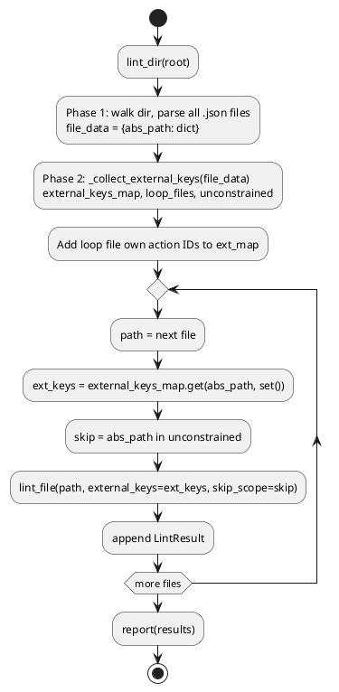

# 08 — Workflow Linter

## Purpose

`clay/lint.py` is a static analysis tool that validates all `.json` files under a directory (or a single file). It catches structural errors before a workflow is run — missing required fields, broken file references, and `includedData` keys used before they are produced.

---

## CLI usage

```bash
clay lint                   # lint everything under workflows/
clay lint path/to/file.json # lint a single file
clay lint --verbose         # also print clean files

# Or as a module:
python -m clay.lint [path] [--verbose|-v]
```

Returns exit code `0` (clean) or `1` (errors found).

---

## Three-phase pipeline

### Phase 1 — Parse

Every `.json` file under the root is parsed. Files that fail JSON parsing or are not a top-level object get `role = "invalid"`.

### Phase 2 — Role detection (`_detect_role`, lint.py:58–61)

```python
def _detect_role(data: dict) -> str:
    if "workflow" in data and "actionSets" in data:
        return "workflow"
    return "data"
```

### Phase 3 — Per-role validation

**workflow**: `_lint_workflow(data, result, external_keys, skip_scope)` (lint.py:233–279)

**data**: `_lint_data(data, result)` (lint.py:282–287) — warns if any top-level value is a nested object.

---

## Workflow checks

### Step ↔ actionSet cross-reference

- **Error**: step listed in `workflow.steps` with no matching `actionSets` key
- **Warning**: `actionSets` key not listed in `workflow.steps`

### Per-action checks

1. Action must be a JSON object
2. `type` field must be present
3. If `type` is in the registry: required-field validation via `_validate_action(action)` (calls `registry.validate`)
4. If `type` is not in the registry: warning only

### `includedData` scope check — `_lint_included_data_scope` (lint.py:164–228)

Verifies that every key listed in `includedData` is in scope when the action runs.

**Initial scope:**

```python
available = set()
available |= defaults                # from workflow "defaults" dict
available |= _SYSTEM_KEYS           # {'__config__', '__schema__'}
available |= _LOOP_INJECTED_KEYS    # {'iteration'}
available |= external_keys          # from caller's includedData (cross-file)
```

As each action executes in step order, its `id` is added to `available`. `loadContext` actions additionally expand `available` with all top-level keys from the referenced JSON file.

**Entry root extraction** (`_included_root`, lint.py:72–80):

```
'key'           → 'key'
'a.b.c'         → 'a'
'alias=a.b.c'   → 'a'
```

Only the root key is checked for scope presence (not the nested path).

---

## Cross-file scope analysis — `lint_dir` (lint.py:328–362)

`lint_dir` runs in three phases:

### Phase 1: parse all JSON files

Builds `file_data: dict[str, dict]` mapping absolute paths to parsed dicts.

### Phase 2: `_collect_external_keys` (lint.py:95–150)

Scans every workflow for `workflow` and `loop` action types and determines which keys each sub-workflow/loop file can receive from its callers.

Returns:
- `external_keys_map` — `{abs_path: set[str]}` of root keys reachable by each file
- `loop_files` — set of abs paths called as loop iterations
- `unconstrained` — set of abs paths called with no `includedData` (full parent context flows through; scope cannot be verified)

### Phase 3: lint each file

- Loop iteration files additionally receive all their own action IDs as external keys (from `prev_result_data`). (lint.py:350–353)
- Files in `unconstrained` have scope checking skipped entirely (no false positives). (lint.py:360)

---

## `LintResult` dataclass (lint.py:44–53)

```python
@dataclass
class LintResult:
    path: str
    role: str = "unknown"     # 'workflow' | 'data' | 'invalid'
    errors: list[str] = field(default_factory=list)
    warnings: list[str] = field(default_factory=list)

    @property
    def ok(self) -> bool:
        return not self.errors
```

---

## Reporter — `report(results, show_clean=False)` (lint.py:378–413)

Prints per-file summaries (only files with issues unless `--verbose`) and a summary line:

```
✗  path/to/workflow.json  [workflow]
   ✗ [step][0] 'shell' missing required field 'command'
   △ actionSet 'unused' is not referenced in workflow.steps

──────────────────────────────────────────────────────
  3 files  ·  2 clean  ·  1 with errors
  2 workflow  1 data
```

Icons: `✓` clean, `△` warnings only, `✗` errors. Returns exit code `0` or `1`.

---

## Public API

```python
from clay.lint import lint, lint_file, lint_dir, report, LintResult

results = lint("workflows")           # file or dir
results = lint_file("wf.json")        # single file, no cross-file analysis
results = lint_dir("workflows/")      # full cross-file analysis
exit_code = report(results, show_clean=False)
```

---

## PlantUML — lint_dir phases



---

## Test coverage — `clay/tests/test_lint.py`

The lint test suite uses `lint_file` and `lint_dir` with temp JSON files. Key test classes:

| Class | What it tests |
|---|---|
| `TestIncludedDataScope` | Preceding action OK, later step error, defaults OK, system keys OK, `iteration` OK, alias root check, dot-path root check, unknown key error |
| `TestExternalKeys` | Parent `includedData` passes key to sub-workflow; missing key is error; loop iteration own IDs; unconstrained caller skips scope check |
| `TestLoadContextExpandsScope` | `loadContext` keys available after the action; not available before it |

---

## Cleanup / Old Paradigms

- The linter imports `_REGISTRY` directly (not just `validate`): `from .actions.registry import validate as _validate_action, _REGISTRY` (lint.py:39). This exposes the internal registry dict to the linter for the "unknown type" warning check.
- `lint_file` called directly (not via `lint_dir`) does no cross-file analysis — `external_keys` defaults to empty set. This means loop iteration files and sub-workflows checked in isolation will raise false-positive scope errors for externally-provided keys.
- `_detect_role` uses only `"workflow"` and `"actionSets"` as the discriminator. A data JSON file that happens to have those keys would be incorrectly classified as a workflow.
